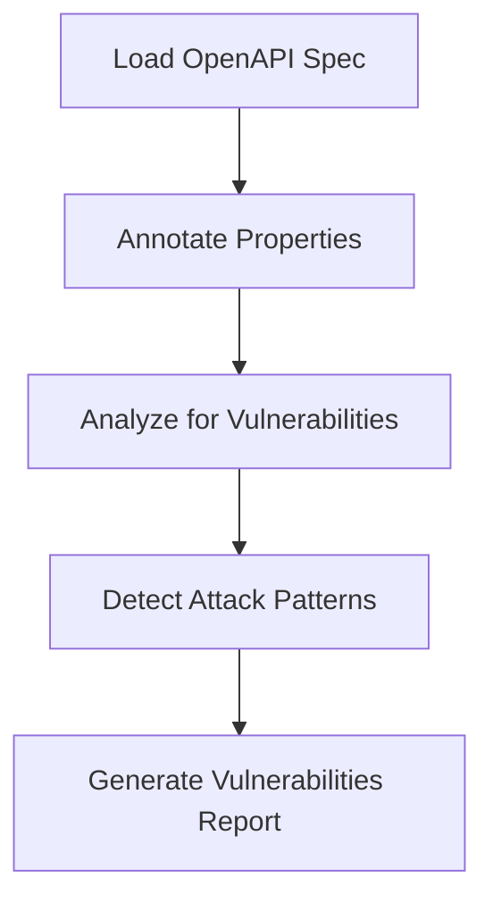
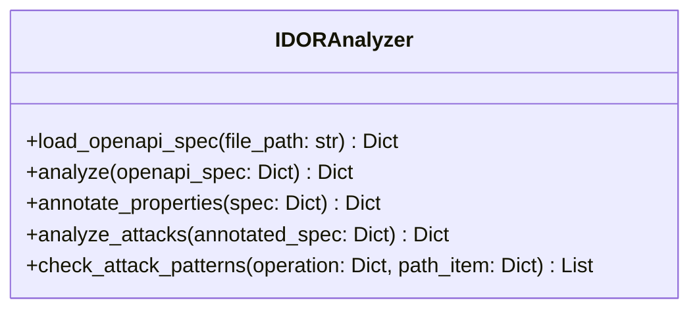

# bugProwler

bugProwler is a security analysis tool designed to detect IDOR (Insecure Direct Object Reference) and BOLA (Broken Object Level Authorization) vulnerabilities in OpenAPI specifications.

## Overview

This tool analyzes OpenAPI specs (JSON or YAML) to identify potential unauthorized access vulnerabilities by applying heuristic rules and attack pattern checks on API endpoints.

## Features

- Loads and parses OpenAPI specifications.
- Annotates API endpoints with security-related metadata.
- Detects various attack techniques such as:
  - Enumeration (with and without prior knowledge)
  - Add/Change file extensions
  - Wildcard replacement/appending
  - ID encoding/decoding
  - JSON list appending
  - Authorization token manipulation
  - Parameter pollution
  - Endpoint verb tampering

## How It Works



## Components



## Usage

1. Provide the path to your OpenAPI spec file (JSON/YAML).
2. Use `IDORAnalyzer.load_openapi_spec(file_path)` to load the specification.
3. Call `IDORAnalyzer.analyze(openapi_spec)` to perform the analysis.
4. Review the returned vulnerabilities report.

## Example

```python
from bugProwler.src.app.swagger_analysis import IDORAnalyzer

analyzer = IDORAnalyzer()
spec = analyzer.load_openapi_spec("path/to/openapi_spec.yaml")
report = analyzer.analyze(spec)
print(report)
```

## License

This project is licensed under the MIT License.